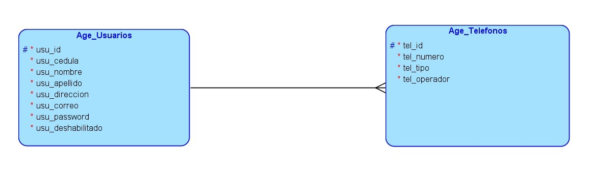
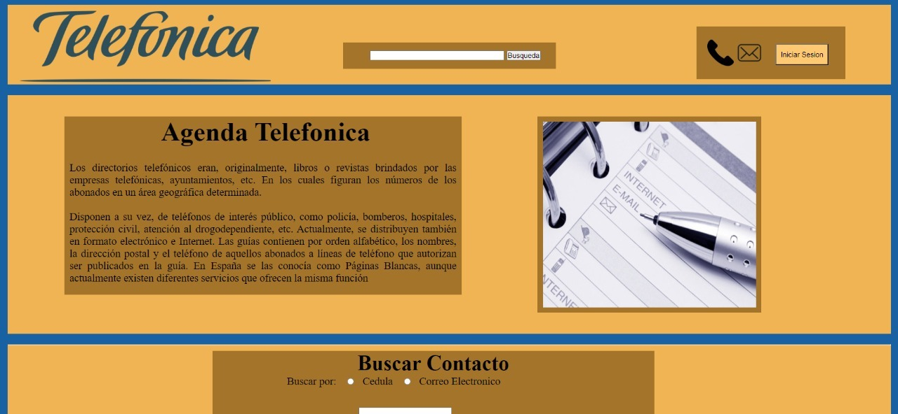
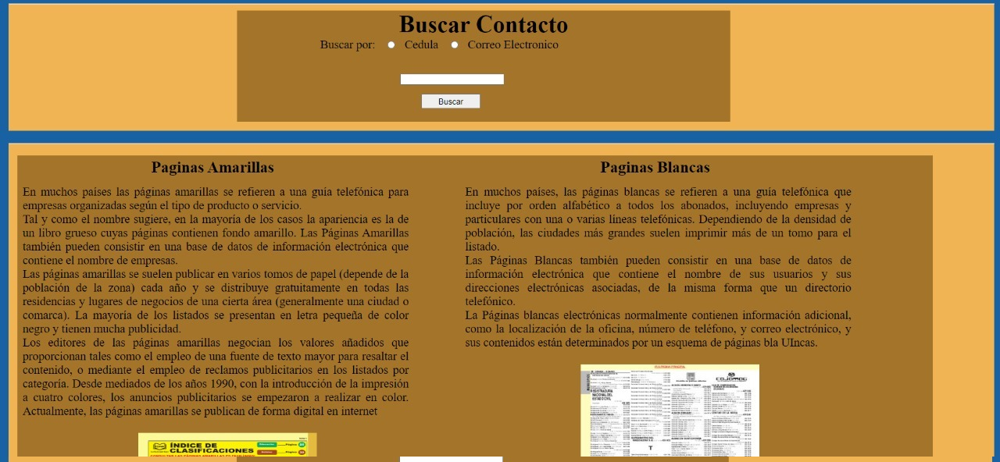
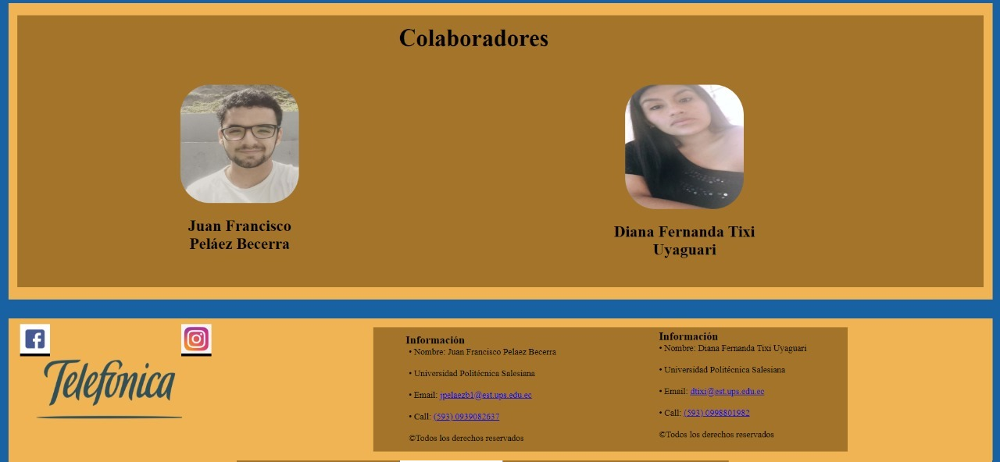
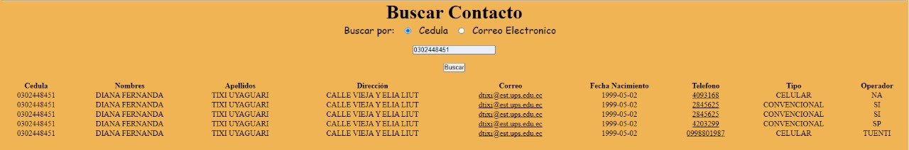

# Practica04-Mi-Agenda-Telef-nica
Praactica 4 de Hipermedial
a. El diagrama E-R de la solución propuesta.

b. Nombre de la base de dato

Base de datos: agendatelefonica

c. Sentencias SQL de la estructura de la base de datos

CREATE TABLE usuarios(
usu_codigo INT(10) PRIMARY KEY,
usu_cedula VARCHAR(10)NOT NULL,
usu_nombres VARCHAR(200)NOT NULL,
usu_apellidos VARCHAR(200)NOT NULL,
usu_direccion VARCHAR(250)NOT NULL,
usu_email VARCHAR(250) NOT NULL,
usu_contrasena VARCHAR(250) NOT NULL,
usu_fecha_nacimiento DATE NOT NULL,
usu_fecha_creacion TIMESTAMP,
usu_deshabilitado CHAR(1),
usu_fecha_modificacion TIMESTAMP
);

CREATE TABLE telefonos(
tel_codigo INT(10) PRIMARY KEY,
tel_usu_codigo VARCHAR(10) NOT NULL,
tel_numero VARCHAR(200)NOT NULL,
tel_tipo VARCHAR(200)NOT NULL,
tel_operadora VARCHAR(250)NOT NULL,
CONSTRAINT FK_tel_usu_codigo FOREIGN KEY (tel_usu_codigo)
REFERENCES personas(usu_codigo)
);

d. La evidencia del correcto diseño de las páginas HTML usando CSS.

Formato aprobado con Res. C.S. N° 076-04-2016-04-20 Página 3 de 5
VICERRECTORADO DOCENTE Código: GUIA-PRL-001
CONSEJO ACADÉMICO Aprobación: 2016/04/06
Formato: Guía de Práctica de Laboratorio / Talleres / Centros de Simulación

e. La evidencia del correcto funcionamiento de cada uno de los puntos requeridos

f. Github

Github:https://github.com/PelaezFrancisco/Practica04-Mi-Agenda-Telef-nica
Usuarios:
● PelaezFrancisco
● DianaTixi

RESULTADO(S) OBTENIDO(S)
CONCLUSIONES:
En conclusión pudimos aprender sobre el valioso trabajo que toma el lenguaje PHP en lo que se refiere a la
programación Hipermedia. Hicimos un proyecto en el cual utilizamos lenguajes como HTML, CSS, Javascript y
PHP. De forma que todos estos trabajan en sincronía con todos los lenguajes y tenemos un sistema 100%
funcional de lenguaje Hipermedia.
Esto nos puede ayudar en la realización de programas de aspecto profesional.
